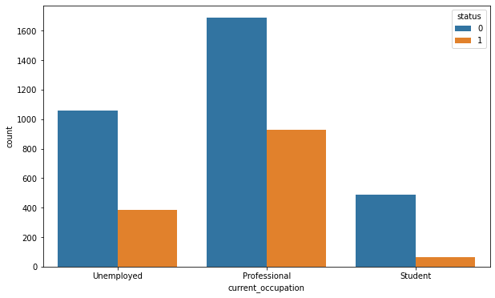

# Potential_Leads_Analysis

# **Decision Trees and Random Forest Project: Predicting Potential Customers**


Welcome to my project on classification using Decision Tree and Random Forest.

--------------------------------
## **Context** 
-------------------------------

The EdTech industry has been surging in the past decade immensely, and according to a forecast, the Online Education market, would be worth $286.62bn by 2023, with a compound annual growth rate (CAGR) of 10.26% from 2018 to 2023. The modern era of online education has enforced a lot in its growth and expansion beyond any limit. Due to having many dominant features like ease of information sharing, personalized learning experience, transparency of assessment, etc., it is now preferable to traditional education. 

The online education sector has witnessed rapid growth and is attracting a lot of new customers. Due to this rapid growth, many new companies have emerged in this industry. With the availability and ease of use of digital marketing resources, companies can reach out to a wider audience with their offerings. The customers who show interest in these offerings are termed as **leads**. There are various sources of obtaining leads for Edtech companies, like:

* The customer interacts with the marketing front on social media or other online platforms. 
* The customer browses the website/app and downloads the brochure.
* The customer connects through emails for more information.

The company then nurtures these leads and tries to convert them to paid customers. For this, the representative from the organization connects with the lead on call or through email to share further details.


----------------------------
## **Objective**
-----------------------------


ExtraaLearn is an initial stage startup that offers programs on cutting-edge technologies to students and professionals to help them upskill/reskill. With a large number of leads being generated on a regular basis, one of the issues faced by ExtraaLearn is to identify which of the leads are more likely to convert so that they can allocate the resources accordingly. You, as a data scientist at ExtraaLearn, have been provided the leads data to:
* Analyze and build an ML model to help identify which leads are more likely to convert to paid customers. 
* Find the factors driving the lead conversion process.
* Create a profile of the leads which are likely to convert.


--------------------------
## **Data Description**
--------------------------

The data contains the different attributes of leads and their interaction details with ExtraaLearn. The detailed data dictionary is given below.

* **ID:** ID of the lead
* **age:** Age of the lead
* **current_occupation:** Current occupation of the lead. Values include 'Professional', 'Unemployed', and 'Student'
* **first_interaction:** How did the lead first interact with ExtraaLearn? Values include 'Website' and 'Mobile App'
* **profile_completed:** What percentage of the profile has been filled by the lead on the website/mobile app? Values include Low - (0-50%), Medium - (50-75%), High (75-100%)
* **website_visits:** The number of times a lead has visited the website
* **time_spent_on_website:** Total time (seconds) spent on the website.
* **page_views_per_visit:** Average number of pages on the website viewed during the visits
* **last_activity:** Last interaction between the lead and ExtraaLearn 
    * **Email Activity:** Seeking details about the program through email, Representative shared information with a lead like a brochure of the program, etc.
    * **Phone Activity:** Had a phone conversation with a representative, had a conversation over SMS with a representative, etc.
    * **Website Activity:** Interacted on live chat with a representative, updated profile on the website, etc.

* **print_media_type1:** Flag indicating whether the lead had seen the ad of ExtraaLearn in the Newspaper
* **print_media_type2:** Flag indicating whether the lead had seen the ad of ExtraaLearn in the Magazine
* **digital_media:** Flag indicating whether the lead had seen the ad of ExtraaLearn on the digital platforms
* **educational_channels:** Flag indicating whether the lead had heard about ExtraaLearn in the education channels like online forums, discussion threads, educational websites, etc.
* **referral:** Flag indicating whether the lead had heard about ExtraaLearn through reference.
* **status:** Flag indicating whether the lead was converted to a paid customer or not. The class 1 represents the paid customer and class 0 represents the unpaid customer.

## **Importing the necessary libraries and overview of the dataset**


```python
import warnings
warnings.filterwarnings("ignore")

# Libraries for data manipulation and visualization
import pandas as pd

import numpy as np

import matplotlib.pyplot as plt

import seaborn as sns

from sklearn.model_selection import train_test_split

# Algorithms to use
from sklearn.tree import DecisionTreeClassifier

from sklearn import tree

from sklearn.ensemble import RandomForestClassifier

# Metrics to evaluate the model
from sklearn.metrics import confusion_matrix, classification_report, recall_score

from sklearn import metrics

# For hyperparameter tuning
from sklearn.model_selection import GridSearchCV
```

### **Loading the dataset**


```python
learn = pd.read_csv("ExtraaLearn.csv")
```


```python
# Copying data to another variable to avoid any changes to the original data
data = learn.copy()
```

### **View the first and the last 5 rows of the dataset**


```python
data.head()
```


<div>

<table border="1" class="dataframe">
  <thead>
    <tr style="text-align: right;">
      <th></th>
      <th>ID</th>
      <th>age</th>
      <th>current_occupation</th>
      <th>first_interaction</th>
      <th>profile_completed</th>
      <th>website_visits</th>
      <th>time_spent_on_website</th>
      <th>page_views_per_visit</th>
      <th>last_activity</th>
      <th>print_media_type1</th>
      <th>print_media_type2</th>
      <th>digital_media</th>
      <th>educational_channels</th>
      <th>referral</th>
      <th>status</th>
    </tr>
  </thead>
  <tbody>
    <tr>
      <th>0</th>
      <td>EXT001</td>
      <td>57</td>
      <td>Unemployed</td>
      <td>Website</td>
      <td>High</td>
      <td>7</td>
      <td>1639</td>
      <td>1.861</td>
      <td>Website Activity</td>
      <td>Yes</td>
      <td>No</td>
      <td>Yes</td>
      <td>No</td>
      <td>No</td>
      <td>1</td>
    </tr>
    <tr>
      <th>1</th>
      <td>EXT002</td>
      <td>56</td>
      <td>Professional</td>
      <td>Mobile App</td>
      <td>Medium</td>
      <td>2</td>
      <td>83</td>
      <td>0.320</td>
      <td>Website Activity</td>
      <td>No</td>
      <td>No</td>
      <td>No</td>
      <td>Yes</td>
      <td>No</td>
      <td>0</td>
    </tr>
    <tr>
      <th>2</th>
      <td>EXT003</td>
      <td>52</td>
      <td>Professional</td>
      <td>Website</td>
      <td>Medium</td>
      <td>3</td>
      <td>330</td>
      <td>0.074</td>
      <td>Website Activity</td>
      <td>No</td>
      <td>No</td>
      <td>Yes</td>
      <td>No</td>
      <td>No</td>
      <td>0</td>
    </tr>
    <tr>
      <th>3</th>
      <td>EXT004</td>
      <td>53</td>
      <td>Unemployed</td>
      <td>Website</td>
      <td>High</td>
      <td>4</td>
      <td>464</td>
      <td>2.057</td>
      <td>Website Activity</td>
      <td>No</td>
      <td>No</td>
      <td>No</td>
      <td>No</td>
      <td>No</td>
      <td>1</td>
    </tr>
    <tr>
      <th>4</th>
      <td>EXT005</td>
      <td>23</td>
      <td>Student</td>
      <td>Website</td>
      <td>High</td>
      <td>4</td>
      <td>600</td>
      <td>16.914</td>
      <td>Email Activity</td>
      <td>No</td>
      <td>No</td>
      <td>No</td>
      <td>No</td>
      <td>No</td>
      <td>0</td>
    </tr>
  </tbody>
</table>
</div>


```python
data.tail()
```


<table border="1" class="dataframe">
  <thead>
    <tr style="text-align: right;">
      <th></th>
      <th>ID</th>
      <th>age</th>
      <th>current_occupation</th>
      <th>first_interaction</th>
      <th>profile_completed</th>
      <th>website_visits</th>
      <th>time_spent_on_website</th>
      <th>page_views_per_visit</th>
      <th>last_activity</th>
      <th>print_media_type1</th>
      <th>print_media_type2</th>
      <th>digital_media</th>
      <th>educational_channels</th>
      <th>referral</th>
      <th>status</th>
    </tr>
  </thead>
  <tbody>
    <tr>
      <th>4607</th>
      <td>EXT4608</td>
      <td>35</td>
      <td>Unemployed</td>
      <td>Mobile App</td>
      <td>Medium</td>
      <td>15</td>
      <td>360</td>
      <td>2.170</td>
      <td>Phone Activity</td>
      <td>No</td>
      <td>No</td>
      <td>No</td>
      <td>Yes</td>
      <td>No</td>
      <td>0</td>
    </tr>
    <tr>
      <th>4608</th>
      <td>EXT4609</td>
      <td>55</td>
      <td>Professional</td>
      <td>Mobile App</td>
      <td>Medium</td>
      <td>8</td>
      <td>2327</td>
      <td>5.393</td>
      <td>Email Activity</td>
      <td>No</td>
      <td>No</td>
      <td>No</td>
      <td>No</td>
      <td>No</td>
      <td>0</td>
    </tr>
    <tr>
      <th>4609</th>
      <td>EXT4610</td>
      <td>58</td>
      <td>Professional</td>
      <td>Website</td>
      <td>High</td>
      <td>2</td>
      <td>212</td>
      <td>2.692</td>
      <td>Email Activity</td>
      <td>No</td>
      <td>No</td>
      <td>No</td>
      <td>No</td>
      <td>No</td>
      <td>1</td>
    </tr>
    <tr>
      <th>4610</th>
      <td>EXT4611</td>
      <td>57</td>
      <td>Professional</td>
      <td>Mobile App</td>
      <td>Medium</td>
      <td>1</td>
      <td>154</td>
      <td>3.879</td>
      <td>Website Activity</td>
      <td>Yes</td>
      <td>No</td>
      <td>No</td>
      <td>No</td>
      <td>No</td>
      <td>0</td>
    </tr>
    <tr>
      <th>4611</th>
      <td>EXT4612</td>
      <td>55</td>
      <td>Professional</td>
      <td>Website</td>
      <td>Medium</td>
      <td>4</td>
      <td>2290</td>
      <td>2.075</td>
      <td>Phone Activity</td>
      <td>No</td>
      <td>No</td>
      <td>No</td>
      <td>No</td>
      <td>No</td>
      <td>0</td>
    </tr>
  </tbody>
</table>
</div>


### **Understand the shape of the dataset**


```python
data.shape
```


    (4612, 15)


* The dataset has **4612 rows and 15 columns.** 

### **Check the data types of the columns in the dataset**


```python
data.info()
```

    <class 'pandas.core.frame.DataFrame'>
    RangeIndex: 4612 entries, 0 to 4611
    Data columns (total 15 columns):
     #   Column                 Non-Null Count  Dtype  
    ---  ------                 --------------  -----  
     0   ID                     4612 non-null   object 
     1   age                    4612 non-null   int64  
     2   current_occupation     4612 non-null   object 
     3   first_interaction      4612 non-null   object 
     4   profile_completed      4612 non-null   object 
     5   website_visits         4612 non-null   int64  
     6   time_spent_on_website  4612 non-null   int64  
     7   page_views_per_visit   4612 non-null   float64
     8   last_activity          4612 non-null   object 
     9   print_media_type1      4612 non-null   object 
     10  print_media_type2      4612 non-null   object 
     11  digital_media          4612 non-null   object 
     12  educational_channels   4612 non-null   object 
     13  referral               4612 non-null   object 
     14  status                 4612 non-null   int64  
    dtypes: float64(1), int64(4), object(10)
    memory usage: 540.6+ KB


**Observations:**

* `age`, `website_visits`, `time_spent_on_website`, `page_views_per_visit`, and `status` are of numeric type while rest of the columns are of object type.

* There are **no null values** in the dataset.


```python
# Checking for duplicate values
data.duplicated().sum()
```


    0


- There are **no duplicate values** in the data.

## **Exploratory Data Analysis**

### **Univariate Analysis**

### **Question 1:** Write the code to find the summary statistics and write your observations based on that. (4 Marks)


```python
# Selecting numerical columns and checking the summary statistics
num_cols = data.select_dtypes('number').columns

data[num_cols].describe().T
```


<div>

<table border="1" class="dataframe">
  <thead>
    <tr style="text-align: right;">
      <th></th>
      <th>count</th>
      <th>mean</th>
      <th>std</th>
      <th>min</th>
      <th>25%</th>
      <th>50%</th>
      <th>75%</th>
      <th>max</th>
    </tr>
  </thead>
  <tbody>
    <tr>
      <th>age</th>
      <td>4612.0</td>
      <td>46.201214</td>
      <td>13.161454</td>
      <td>18.0</td>
      <td>36.00000</td>
      <td>51.000</td>
      <td>57.00000</td>
      <td>63.000</td>
    </tr>
    <tr>
      <th>website_visits</th>
      <td>4612.0</td>
      <td>3.566782</td>
      <td>2.829134</td>
      <td>0.0</td>
      <td>2.00000</td>
      <td>3.000</td>
      <td>5.00000</td>
      <td>30.000</td>
    </tr>
    <tr>
      <th>time_spent_on_website</th>
      <td>4612.0</td>
      <td>724.011275</td>
      <td>743.828683</td>
      <td>0.0</td>
      <td>148.75000</td>
      <td>376.000</td>
      <td>1336.75000</td>
      <td>2537.000</td>
    </tr>
    <tr>
      <th>page_views_per_visit</th>
      <td>4612.0</td>
      <td>3.026126</td>
      <td>1.968125</td>
      <td>0.0</td>
      <td>2.07775</td>
      <td>2.792</td>
      <td>3.75625</td>
      <td>18.434</td>
    </tr>
    <tr>
      <th>status</th>
      <td>4612.0</td>
      <td>0.298569</td>
      <td>0.457680</td>
      <td>0.0</td>
      <td>0.00000</td>
      <td>0.000</td>
      <td>1.00000</td>
      <td>1.000</td>
    </tr>
  </tbody>
</table>
</div>


**Observations:**

* The average age of a lead is 46, with a minimum of 18 and a maximum of 63 years old. At least 75% of the leads are 57 years of age, which means most of the leads are older adults. 
* The maximum value for website visits are 30 times. This is a big difference in the 75th percentile of 5 times. This might indicate outliers present. The minimum of 0 is interesting. 
* The average time spent on the website is 724 seconds. However, at least 75% are spending almost twice that time with 1336 seconds. Which means the minimum value of 0 might be impacting the mean and we should look at those values more closely.
* Most of the leads visit at least 3 or more pages on the website. Although, there is a big difference from the 75 percentile and the maximum value of 18 pages visited. This might suggest outliers. 
* Status is either 1 or 0 depending on whether they became a paid customer or not. The mean of approx. 30 is higher than the 50 percentile which means the data is skewed slightly to the right. The std of about 0.46 means the data is dispersed. 


```python
# Making a list of all categorical variables
cat_col = list(data.select_dtypes("object").columns)

# Printing count of each unique value in each categorical column
for column in cat_col:
    print(data[column].value_counts(normalize = True))
    print("-" * 50)
```

    EXT001     0.000217
    EXT2884    0.000217
    EXT3080    0.000217
    EXT3079    0.000217
    EXT3078    0.000217
                 ...   
    EXT1537    0.000217
    EXT1536    0.000217
    EXT1535    0.000217
    EXT1534    0.000217
    EXT4612    0.000217
    Name: ID, Length: 4612, dtype: float64
    --------------------------------------------------
    Professional    0.567216
    Unemployed      0.312446
    Student         0.120338
    Name: current_occupation, dtype: float64
    --------------------------------------------------
    Website       0.551171
    Mobile App    0.448829
    Name: first_interaction, dtype: float64
    --------------------------------------------------
    High      0.490893
    Medium    0.485906
    Low       0.023200
    Name: profile_completed, dtype: float64
    --------------------------------------------------
    Email Activity      0.493929
    Phone Activity      0.267563
    Website Activity    0.238508
    Name: last_activity, dtype: float64
    --------------------------------------------------
    No     0.892238
    Yes    0.107762
    Name: print_media_type1, dtype: float64
    --------------------------------------------------
    No     0.94948
    Yes    0.05052
    Name: print_media_type2, dtype: float64
    --------------------------------------------------
    No     0.885733
    Yes    0.114267
    Name: digital_media, dtype: float64
    --------------------------------------------------
    No     0.847138
    Yes    0.152862
    Name: educational_channels, dtype: float64
    --------------------------------------------------
    No     0.979835
    Yes    0.020165
    Name: referral, dtype: float64
    --------------------------------------------------


**Observations:**
* Most of the leads are working professionals.
* As expected, the majority of the leads interacted with ExtraaLearn from the website.
* Almost an equal percentage of profile completions are categorized as high and medium that is 49.1% and 48.6%, respectively. Only **2.3%** of the profile completions are categorized as low.
* Approx 49.4% of the leads had their last activity over email, followed by 26.8% having phone activity. This implies that the majority of the leads prefer to communicate via email.
* We can observe that each ID has an equal percentage of values. Let's check the number of unique values in the ID column.


```python
# Checking the number of unique values
data["ID"].nunique()
```


    4612


* All the values in the ID column are unique.
* We can drop this column as it would not add value to our analysis.


```python
# Dropping ID column
data.drop(["ID"], axis = 1, inplace = True)
```


```python
plt.figure(figsize = (10, 6))

ax = sns.countplot(x = 'status', data = data)

# Annotating the exact count on the top of the bar for each category 
for p in ax.patches:
    ax.annotate('{:.1f}'.format(p.get_height()), (p.get_x(), p.get_height()+ 0.35))
```


    

    


- The above plot shows that number of leads converted are significantly less than number of leads not converted which can be expected.
- The plot indicates that **~30%** (1377/4612) of leads have been converted.

**Let's check the distribution and outliers for numerical columns in the data**

### **Observations for below distribution plots and box plots.**


```python
for col in ['age', 'website_visits', 'time_spent_on_website', 'page_views_per_visit']:
    print(col)
    
    print('Skew :',round(data[col].skew(), 2))
    
    plt.figure(figsize = (15, 4))
    
    plt.subplot(1, 2, 1)
    
    data[col].hist(bins = 10, grid = False)
    
    plt.ylabel('count')
    
    plt.subplot(1, 2, 2)
    
    sns.boxplot(x = data[col])
    
    plt.show()
```

    age
    Skew : -0.72


    

    


    website_visits
    Skew : 2.16


    

    


    time_spent_on_website
    Skew : 0.95


    

    


    page_views_per_visit
    Skew : 1.27


    

    


Observations:

 - The distribution of age is left-skewed which shows the majority of leads are 55 - 65 years old. 
 - Website visits is right-skewed which shows the majority of visits range from 0 to approximately 7 times. There are some outliers. Which means that some leads visited the website from 10 to even 30 times.
 - Time spent on the website is right-skewed which means that most of the leads spent less than 700 seconds (~12  min) on the website.
 - Page views per visit distribution was approximately normal. Most leads visited 2.5 to 3.5 pages. However, there were many outliers that visited from 7.5 to more than 17.5 pages. 
 


### **Bivariate Analysis**

**We are done with univariate analysis and data preprocessing. Let's explore the data a bit more with bivariate analysis.**

Leads will have different expectations from the outcome of the course and their current occupation may play a key role for them to take the program. Let's analyze it.


```python
plt.figure(figsize = (10, 6))

sns.countplot(x = 'current_occupation', hue = 'status', data = data)

plt.show()
```


    

    


**Observations:**

- The plot shows that working professional leads are more likely to opt for a course offered by the organization and the students are least likely to be converted. 
- This shows that the currently offered programs are more oriented toward working professionals or unemployed personnel. The programs might be suitable for the working professionals who might want to transition to a new role or take up more responsibility in their current role. And also focused on skills that are in high demand making it more suitable for working professionals or currently unemployed leads.

**Age can also be a good factor to differentiate between such leads. Let's explore this.**


```python
plt.figure(figsize = (10, 5))

sns.boxplot(data["current_occupation"], data["age"])

plt.show()
```


    

    


```python
data.groupby(["current_occupation"])["age"].describe()
```


<div>

<table border="1" class="dataframe">
  <thead>
    <tr style="text-align: right;">
      <th></th>
      <th>count</th>
      <th>mean</th>
      <th>std</th>
      <th>min</th>
      <th>25%</th>
      <th>50%</th>
      <th>75%</th>
      <th>max</th>
    </tr>
    <tr>
      <th>current_occupation</th>
      <th></th>
      <th></th>
      <th></th>
      <th></th>
      <th></th>
      <th></th>
      <th></th>
      <th></th>
    </tr>
  </thead>
  <tbody>
    <tr>
      <th>Professional</th>
      <td>2616.0</td>
      <td>49.347477</td>
      <td>9.890744</td>
      <td>25.0</td>
      <td>42.0</td>
      <td>54.0</td>
      <td>57.0</td>
      <td>60.0</td>
    </tr>
    <tr>
      <th>Student</th>
      <td>555.0</td>
      <td>21.144144</td>
      <td>2.001114</td>
      <td>18.0</td>
      <td>19.0</td>
      <td>21.0</td>
      <td>23.0</td>
      <td>25.0</td>
    </tr>
    <tr>
      <th>Unemployed</th>
      <td>1441.0</td>
      <td>50.140180</td>
      <td>9.999503</td>
      <td>32.0</td>
      <td>42.0</td>
      <td>54.0</td>
      <td>58.0</td>
      <td>63.0</td>
    </tr>
  </tbody>
</table>
</div>


**Observations:**

* The range of age for students is 18 to 25 years.
* The range of age for professionals is 25 to 60 years.
* The range of age for unemployed leads is 32 to 63 years.
* The average age of working professionals and unemployed leads is almost 50 years.

**The company's first interaction with leads should be compelling and persuasive. Let's see if the channels of the first interaction have an impact on the conversion of leads.**


```python
plt.figure(figsize = (10, 6))

sns.countplot(x = 'first_interaction', hue = 'status', data = data)

plt.show()
```


    

    


**Observations:**

* The website seems to be doing a good job as compared to mobile app as there is a huge difference in the number of conversions of the leads who first interacted with the company through website and those who interacted through mobile application.
* Majority of the leads who interacted through websites were converted to paid customers, while only a small number of leads, who interacted through mobile app, converted.

**We observed earlier that some leads spend more time on websites than others. Let's analyze if spending more time on websites results in conversion.**

### **Boxplot for variables 'status' and 'time_spent_on_website'**


```python
plt.figure(figsize = (10, 5))

sns.boxplot(data["status"], data["time_spent_on_website"])

plt.show()

```


    

    


**Observations:**

- Time spent on the website is a good indicator for whether leads will buy or not. The more time is spent on the website the better the chance they converted to paid customers.
- There are many outliers through of leads that did spend more than average time on the website but still did not convert into paid customers. 

**People browsing the website or the mobile app are generally required to create a profile by sharing their details before they can access more information. Let's see if the profile completion level has an impact on lead coversion**


```python
plt.figure(figsize = (10, 6))

sns.countplot(x = 'profile_completed', hue = 'status', data = data)

plt.show()
```


    

    


**Observations:**

* The leads whose profile completion level is high converted more in comparison to other levels of profile completion.
* The medium and low levels of profile completion saw comparatively very less conversions.
* The high level of profile completion might indicate a lead's intent to pursue the course which results in high conversion.

**Referrals from a converted lead can be a good source of income with a very low cost of advertisement. Let's see how referrals impact lead conversion status.**


```python
plt.figure(figsize = (10, 6))

sns.countplot(x = 'referral', hue = 'status', data = data)

plt.show()
```


    

    


**Observations:**
* There are a very few referrals but the conversion is high. 
* Company should try to get more leads through referrals by promoting rewards for existing customer base when they refer someone.

### Plotting the correlation heatmap


```python
plt.figure(figsize = (12, 7))

sns.heatmap(data.corr(), annot = True, fmt = '.2f')

plt.show()
```


    

    


**Observations:**

 - There is a weak positive correlation between time spent on website and status. Which indicates a liklihood that the longer a lead stays on the website the better the chance of converting them to a paid customer.
 - There are no other correlations.

## **Data preparation for modeling**

- We want to predict which lead is more likely to be converted.
- Before we proceed to build a model, we'll have to encode categorical features.
- We'll split the data into train and test sets to be able to evaluate the model that we build on the train data.


```python
# Separating the target variable and other variables
X = data.drop(columns = 'status')

Y = data['status']
```


```python
# Creating dummy variables, drop_first=True is used to avoid redundant variables
X = pd.get_dummies(X, drop_first = True)
```


```python
# Splitting the data into train and test sets
X_train, X_test, y_train, y_test = train_test_split(X, Y, test_size = 0.30, random_state = 1)
```

**Checking the shape of the train and test data**


```python
print("Shape of the training set: ", X_train.shape)   

print("Shape of the test set: ", X_test.shape)

print("Percentage of classes in the training set:")

print(y_train.value_counts(normalize = True))

print("Percentage of classes in the test set:")

print(y_test.value_counts(normalize = True))
```

    Shape of the training set:  (3228, 16)
    Shape of the test set:  (1384, 16)
    Percentage of classes in the training set:
    0    0.704151
    1    0.295849
    Name: status, dtype: float64
    Percentage of classes in the test set:
    0    0.695087
    1    0.304913
    Name: status, dtype: float64


## **Building Classification Models**

**Before training the model, let's choose the appropriate model evaluation criterion as per the problem at hand.**

### **Model evaluation criterion**

**Model can make wrong predictions as:**

1. Predicting a lead will not be converted to a paid customer but, in reality, the lead would have converted to a paid customer.
2. Predicting a lead will be converted to a paid customer but, in reality, the lead would have not converted to a paid customer. 

### **Which case is more important?** 

* If we predict that a lead will not get converted and the lead would have converted then the company will lose a potential customer. 

* If we predict that a lead will get converted and the lead doesn't get converted the company might lose resources by nurturing false-positive cases.

Losing a potential customer is a greater loss for the organization.

### **How to reduce the losses?**

* Company would want `Recall` to be maximized. The greater the Recall score, higher the chances of minimizing False Negatives. 

**Also, let's create a function to calculate and print the classification report and confusion matrix so that we don't have to rewrite the same code repeatedly for each model.**


```python
# Function to print the classification report and get confusion matrix in a proper format

def metrics_score(actual, predicted):
    print(classification_report(actual, predicted))
    
    cm = confusion_matrix(actual, predicted)
    
    plt.figure(figsize = (8, 5))
    
    sns.heatmap(cm, annot = True,  fmt = '.2f', xticklabels = ['Not Converted', 'Converted'], yticklabels = ['Not Converted', 'Converted'])
    
    plt.ylabel('Actual')
    
    plt.xlabel('Predicted')
    
    plt.show()
```

### **Decision Tree**

- **Fit the decision tree classifier on the training data (use random_state=7)**
- **Check the performance on both training and testing datasets (use metrics_score function)**


```python
# Fitting the decision tree classifier on the training data
d_tree = DecisionTreeClassifier(random_state = 7)

d_tree.fit(X_train, y_train)
```


    DecisionTreeClassifier(random_state=7)


**Let's check the performance on the training data**


```python
# Checking performance on the training data
y_pred_train1 = d_tree.predict(X_train)

metrics_score(y_train, y_pred_train1)
```

                  precision    recall  f1-score   support
    
               0       1.00      1.00      1.00      2273
               1       1.00      1.00      1.00       955
    
        accuracy                           1.00      3228
       macro avg       1.00      1.00      1.00      3228
    weighted avg       1.00      1.00      1.00      3228
    


    

    


**Reading confusion matrix (clockwise):**

- **True Positive**: Predicting the lead will not convert the booking and the lead does not convert.
- **False Positive**: Predicting the lead will not convert and the lead is converted.
- **True Negative**: Predicting the lead will convert to a paid customer and the lead does convert.
- **False Negative**: Predicting the lead will convert to a paid customer but the lead does not converted.

**Observations:**

 - There is no error on the training set, i.e., each sample has been classified. 
 - The Recall score is maximized. So, there is a better chance at minimizing False Negatives.
 - However, we need to see if the model is overfitting the data.


**Let's check the performance on test data to see if the model is overfitting.**


```python
# Checking performance on the testing data
y_pred_test1 = d_tree.predict(X_test)

metrics_score(y_test, y_pred_test1)
```

                  precision    recall  f1-score   support
    
               0       0.87      0.86      0.87       962
               1       0.69      0.70      0.70       422
    
        accuracy                           0.81      1384
       macro avg       0.78      0.78      0.78      1384
    weighted avg       0.81      0.81      0.81      1384
    


    

    


**Observations:**

* The decision tree model is overfitting the training data as expected and is not able to generalize well on the test set.

**Let's try hyperparameter tuning using GridSearchCV to find the optimal max_depth** to reduce overfitting of the model. We can tune some other hyperparameters as well.

### **Decision Tree - Hyperparameter Tuning**

We will use the class_weight hyperparameter with the value equal to {0: 0.3, 1: 0.7} which is approximately the opposite of the imbalance in the original data. 

**This would tell the model that 1 is the important class here.**


```python
# Choose the type of classifier 
d_tree_tuned = DecisionTreeClassifier(random_state = 7, class_weight = {0: 0.3, 1: 0.7})

# Grid of parameters to choose from
parameters = {'max_depth': np.arange(2, 10), 
              'criterion': ['gini', 'entropy'],
              'min_samples_leaf': [5, 10, 20, 25]
             }

# Type of scoring used to compare parameter combinations - recall score for class 1
scorer = metrics.make_scorer(recall_score, pos_label = 1)

# Run the grid search
grid_obj = GridSearchCV(d_tree_tuned, parameters, scoring = scorer, cv = 5)

grid_obj = grid_obj.fit(X_train, y_train)

# Set the classifier to the best combination of parameters
d_tree_tuned = grid_obj.best_estimator_

# Fit the best algorithm to the data
d_tree_tuned.fit(X_train, y_train)
```


    DecisionTreeClassifier(class_weight={0: 0.3, 1: 0.7}, criterion='entropy',
                           max_depth=3, min_samples_leaf=5, random_state=7)


We have tuned the model and fit the tuned model on the training data. Now, **let's check the model performance on the training and testing data.**

### **Question 6:**
- **Check the performance on both training and testing datasets (4 Marks)**
- **Compare the results with the results from the decision tree model with default parameters and write your observations (4 Marks)**


```python
# Checking performance on the training data
y_pred_train2 = d_tree_tuned.predict(X_train)

metrics_score(y_train, y_pred_train2)
```

                  precision    recall  f1-score   support
    
               0       0.94      0.77      0.85      2273
               1       0.62      0.88      0.73       955
    
        accuracy                           0.80      3228
       macro avg       0.78      0.83      0.79      3228
    weighted avg       0.84      0.80      0.81      3228
    


    

    


**Observations:**

- The performance on the training data has decreased which is expected as we are trying not to overfit the training dataset.
- The model can identify the majority of unconverted leads.

**Let's check the model performance on the testing data**


```python
# Checking performance on the testing data
y_pred_test2 =  d_tree_tuned.predict(X_test)

metrics_score(y_test, y_pred_test2)
```

                  precision    recall  f1-score   support
    
               0       0.93      0.77      0.84       962
               1       0.62      0.86      0.72       422
    
        accuracy                           0.80      1384
       macro avg       0.77      0.82      0.78      1384
    weighted avg       0.83      0.80      0.80      1384
    


    

    


**Observations:**

- The recall is higher but the precision is lower.
- The overfitting has been reduced. The model is performing more generalized on both training and testing data.

**Let's visualize the tuned decision tree** and observe the decision rules:

### **Below visualization of the tuned decision tree. **


```python
features = list(X.columns)

plt.figure(figsize = (20, 20))

tree.plot_tree(d_tree_tuned, feature_names = features, filled = True, fontsize = 9, node_ids = True, class_names = True)

plt.show()
```


    

    


**Note:** Blue leaves represent the converted leads, i.e., **y[1]**, while the orange leaves represent the not converted leads, i.e., **y[0]**. Also, the more the number of observations in a leaf, the darker its color gets.

**Observations:**

- **The first split in the decision tree is at the first interaction of the website** which implies that it is one of the most important factors in deciding whether the lead will be converted or not.
- As per decision rules, leads who spent more time on the website, are more likely to convert.
- The leads whose age was greater than 25 are more likely to convert to paid customers. 
- Leads that spent less time on the website and were younger than 25 were more like to not covert to a paid customer.


**Let's look at the feature importance** of the tuned decision tree model


```python
# Importance of features in the tree building

print (pd.DataFrame(d_tree_tuned.feature_importances_, columns = ["Imp"], index = X_train.columns).sort_values(by = 'Imp', ascending = False))
```

                                         Imp
    time_spent_on_website           0.348142
    first_interaction_Website       0.327181
    profile_completed_Medium        0.239274
    age                             0.063893
    last_activity_Website Activity  0.021511
    website_visits                  0.000000
    page_views_per_visit            0.000000
    current_occupation_Student      0.000000
    current_occupation_Unemployed   0.000000
    profile_completed_Low           0.000000
    last_activity_Phone Activity    0.000000
    print_media_type1_Yes           0.000000
    print_media_type2_Yes           0.000000
    digital_media_Yes               0.000000
    educational_channels_Yes        0.000000
    referral_Yes                    0.000000


```python
# Plotting the feature importance
importances = d_tree_tuned.feature_importances_

indices = np.argsort(importances)

plt.figure(figsize = (10, 10))

plt.title('Feature Importances')

plt.barh(range(len(indices)), importances[indices], color = 'violet', align = 'center')

plt.yticks(range(len(indices)), [features[i] for i in indices])

plt.xlabel('Relative Importance')

plt.show()
```


    

    


**Observations:**
- **Time spent on the website and first_interaction_website are the most important features** **followed by profile_completed, age, and last_activity**.
- **The rest of the variables have no impact in this model, while deciding whether a lead will be converted or not**.

Now, let's build another model - **a random forest classifier.**

### **Random Forest Classifier**

- **Fit the random forest classifier on the training data (use random_state = 7)**
- **Check the performance on both training and testing data (use metrics_score function)**


```python
# Fitting the random forest tree classifier on the training data
rf_estimator =  RandomForestClassifier(random_state = 7, criterion = "entropy")
rf_estimator.fit(X_train,y_train)
```


    RandomForestClassifier(criterion='entropy', random_state=7)


**Let's check the performance of the model on the training data**


```python
# Checking performance on the training data
y_pred_train3 = rf_estimator.predict(X_train)

metrics_score(y_train, y_pred_train3)
```

                  precision    recall  f1-score   support
    
               0       1.00      1.00      1.00      2273
               1       1.00      1.00      1.00       955
    
        accuracy                           1.00      3228
       macro avg       1.00      1.00      1.00      3228
    weighted avg       1.00      1.00      1.00      3228
    


    

    


**Observations:**
- Similar to the decision tree, **the random forest is giving a perfect/better performance on the training data.**
- The model is most likely overfitting to the training dataset as we observed for the decision tree. 


**Let's check the performance on the testing data**


```python
# Checking performance on the testing data
y_pred_test3 = rf_estimator.predict(X_test)

metrics_score(y_test, y_pred_test3)
```

                  precision    recall  f1-score   support
    
               0       0.88      0.93      0.90       962
               1       0.81      0.70      0.75       422
    
        accuracy                           0.86      1384
       macro avg       0.84      0.81      0.83      1384
    weighted avg       0.86      0.86      0.86      1384
    


    

    


**Observations:**
- Comparatively, the results from random forest classifier were decent on both training and testing data.
- It has higher F1_Score and the precision on the testing data. The recall is lower.

**Let's see if we can get a better model by tuning the random forest classifier**

### **Random Forest Classifier - Hyperparameter Tuning**

Let's try **tuning some of the important hyperparameters of the Random Forest Classifier**. 

We will **not** tune the `criterion` hyperparameter as we know from hyperparameter tuning for decision trees that `entropy` is a better splitting criterion for this data.


```python
# Choose the type of classifier
rf_estimator_tuned = RandomForestClassifier(criterion = "entropy", random_state = 7)

# Grid of parameters to choose from
parameters = {"n_estimators": [100, 110, 120],
    "max_depth": [5, 6, 7],
    "max_features": [0.8, 0.9, 1]
             }

# Type of scoring used to compare parameter combinations - recall score for class 1
scorer = metrics.make_scorer(recall_score, pos_label = 1)

# Run the grid search
grid_obj = GridSearchCV(rf_estimator_tuned, parameters, scoring = scorer, cv = 5)

grid_obj = grid_obj.fit(X_train, y_train)

# Set the classifier to the best combination of parameters
rf_estimator_tuned = grid_obj.best_estimator_
```


```python
# Fitting the best algorithm to the training data
rf_estimator_tuned.fit(X_train, y_train)
```


    RandomForestClassifier(criterion='entropy', max_depth=6, max_features=0.8,
                           n_estimators=110, random_state=7)


```python
# Checking performance on the training data
y_pred_train4 = rf_estimator_tuned.predict(X_train)

metrics_score(y_train, y_pred_train4)
```

                  precision    recall  f1-score   support
    
               0       0.91      0.92      0.91      2273
               1       0.80      0.78      0.79       955
    
        accuracy                           0.88      3228
       macro avg       0.86      0.85      0.85      3228
    weighted avg       0.88      0.88      0.88      3228
    


    

    


**Observations:**
- We can see that after hyperparameter tuning, the model is performing poorly on the train data as well.
- We can try adding some other hyperparameters and/or changing values of some hyperparameters to tune the model and see if we can get better performance.

**Note:** **GridSearchCV can take a long time to run** depending on the number of hyperparameters and the number of values tried for each hyperparameter. **Therefore, we have reduced the number of values passed to each hyperparameter.** 

- **Tune the random forest classifier using GridSearchCV**
- **Check the performance on both training and testing datasets**
- **Compare the results with the results from the random forest model with default parameters** 

**Note:** The below code might take some time to run depending on your system's configuration.


```python
# Choose the type of classifier 
rf_estimator_tuned = RandomForestClassifier(criterion = "entropy", random_state = 7)

# Grid of parameters to choose from
parameters = {"n_estimators": [110, 120],
    "max_depth": [6, 7],
    "min_samples_leaf": [20, 25],
    "max_features": [0.8, 0.9],
    "max_samples": [0.9, 1],
    "class_weight": ["balanced",{0: 0.3, 1: 0.7}]
             }

# Type of scoring used to compare parameter combinations - recall score for class 1
scorer = metrics.make_scorer(recall_score, pos_label = 1)

# Run the grid search on the training data using scorer=scorer and cv=5
grid_obj = GridSearchCV(rf_estimator_tuned, parameters, scoring = scorer, cv = 5)

grid_obj = grid_obj.fit(X_train, y_train)

# Save the best estimator to variable rf_estimator_tuned
rf_estimator_tuned = grid_obj.best_estimator_

#Fit the best estimator to the training data
rf_estimator_tuned.fit(X_train, y_train)
```


    RandomForestClassifier(class_weight='balanced', criterion='entropy',
                           max_depth=6, max_features=0.8, max_samples=0.9,
                           min_samples_leaf=25, n_estimators=120, random_state=7)


**Let's check the performance of the tuned model**


```python
# Checking performance on the training data
y_pred_train5 = rf_estimator_tuned.predict(X_train)

metrics_score(y_train, y_pred_train5)
```

                  precision    recall  f1-score   support
    
               0       0.94      0.83      0.88      2273
               1       0.68      0.87      0.76       955
    
        accuracy                           0.84      3228
       macro avg       0.81      0.85      0.82      3228
    weighted avg       0.86      0.84      0.84      3228
    


    

    


**Observations:**

- The recall improved, everything else decreased.

**Let's check the model performance on the test data**


```python
# Checking performance on the test data
y_pred_test5 = rf_estimator_tuned.predict(X_test)

metrics_score(y_test, y_pred_test5)
```

                  precision    recall  f1-score   support
    
               0       0.93      0.83      0.87       962
               1       0.68      0.85      0.76       422
    
        accuracy                           0.83      1384
       macro avg       0.81      0.84      0.82      1384
    weighted avg       0.85      0.83      0.84      1384
    


    

    


**Observations:**

- The precision, recall, and f1-score is lower for the random forest with default parameters.  
- The tuned random forest models have a higher precision, recall, and f1-score which makes these a better potential model for identifying which leads are going to get converted.

**One of the drawbacks of ensemble models is that we lose the ability to obtain an interpretation of the model. We cannot observe the decision rules for random forests the way we did for decision trees. So, let's just check the feature importance of the model.**


```python
importances = rf_estimator_tuned.feature_importances_

indices = np.argsort(importances)

feature_names = list(X.columns)

plt.figure(figsize = (12, 12))

plt.title('Feature Importances')

plt.barh(range(len(indices)), importances[indices], color = 'violet', align = 'center')

plt.yticks(range(len(indices)), [feature_names[i] for i in indices])

plt.xlabel('Relative Importance')

plt.show()
```


    

    


**Observations:**
- Similar to the decision tree model, **time spent on website, first_interaction_website, profile_completed, and age are the top four features** that help distinguish between not converted and converted leads.
- Unlike the decision tree, **the random forest gives some importance to other variables like occupation, page_views_per_visit, as well.** This implies that the random forest is giving importance to more factors in comparison to the decision tree.

## **Conclusion and Recommendations**

### **Conclusions:**

- Our goal is to maximize the Recall value. The greater the Recall score, higher the chances of minimizing False Negatives. The higher chance of predicting whether a lead will convert or not. 
- We have been able to build tree-based models that can be used by the company to predict which leads are likely to be converted and plan their marketing strategies accordingly. 

- The tuned random forest model is giving the highest Recall score of 85% and the macro average of 84% on the test data.

- Unlike the decision tree, the random forest gives some importance to other variables like occupation, page_views_per_visit, as well. This implies that the random forest is giving importance to more factors in comparison to the decision tree.

- Looking at important variables, based on the feature importances, we can say that the time_spent_on_website, age, profile_completion, and age, are the major factors of the model.

- The Decision tree model is highly overfitting the training data and gives an Recall score of 86% on the test data. The tuned Decision Tree model is very balanced and gives more generalized results on both training and testing data.

- Using the tuned random forest model which has a 85% Recall score with decent precision and F1 scores, the company will be able to predict which leads will be and will not be converted. The company will be able to market to potential leads that will be converted.

### **Business Recommendations**

1. The time spent on the website can play a key role in identifying if a lead will be converted or not. We observed that the more time a lead spends on the website the more likely they are to convert.
   * The company should spend time and money developing their website to attract and keep the attention of leads.
2. Leads that filled out the profile had a higher chance of converting.
   * Encouraging leads to fill out the profile with a discount might improve the number of profiles completed. 
3. The older a lead was the more likely they were to convert.
    * The company should market to older adults, to attract more of these types of leads.


```python

```
